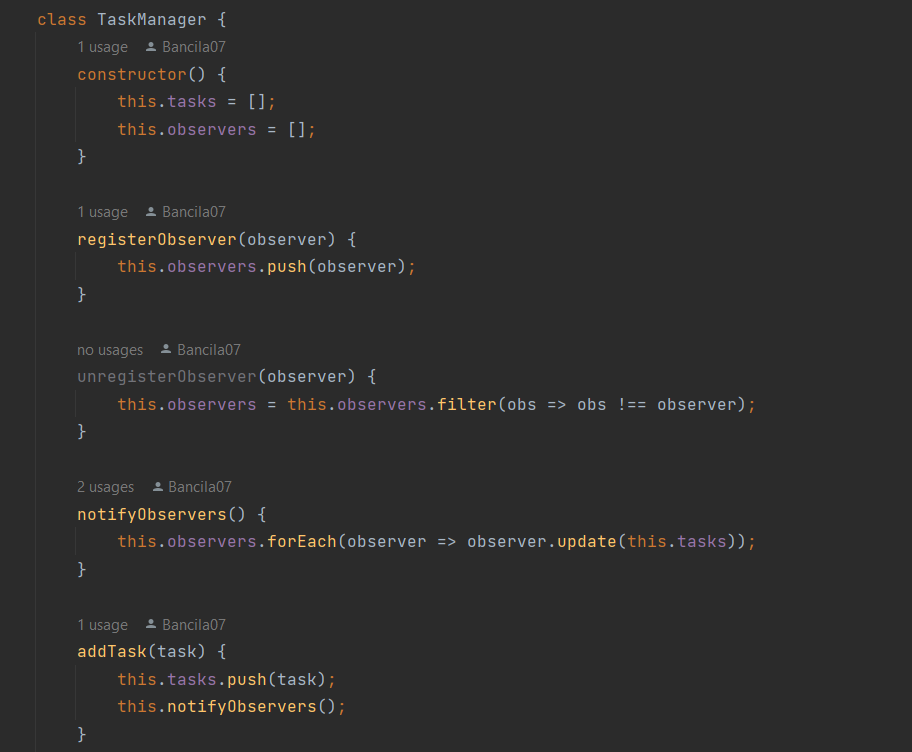
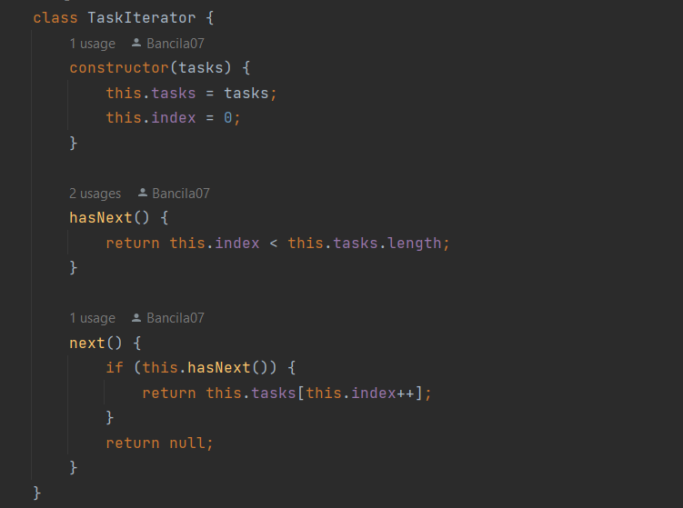

# Despre Aplicatie
Aplicația de gestionare a sarcinilor (task management) pe care am implementat-o are ca scop să permită utilizatorilor să adauge, șteargă și afișeze sarcini într-o listă. Această aplicație folosește trei tipare de design comportamentale pentru a îmbunătăți modularitatea și flexibilitatea codului.
#### Observer Pattern
#### Command Pattern
#### Iterator Pattern
# Obiective
Aplicația oferă o demonstrație practică a acestor modele de design în acțiune. Fiecare model este implementat folosind clasele și interfețele adecvate, prezentând conceptele lor cheie și scenariile de utilizare.
# Caracteristici
#### Observer Pattern:
Patternul Observer este folosit pentru a realiza o comunicare de tip "one-to-many" între obiecte. În aplicația noastră, avem un obiect TaskManager care acționează ca subiect (Subject) și un obiect TaskList care acționează ca observator (Observer). Atunci când sunt adăugate sau șterse sarcini din TaskManager, observatorul TaskList este notificat și actualizează în mod dinamic lista de sarcini afișate în interfața HTML.
#### Command Pattern:
Patternul Command este utilizat pentru a encapsula acțiuni ca obiecte. În aplicația noastră, avem două comenzi: AddTaskCommand și RemoveTaskCommand. Aceste comenzi encapsulează logica pentru adăugarea și ștergerea sarcinilor din TaskManager. Utilizăm aceste comenzi pentru a permite adăugarea și ștergerea sarcinilor prin completarea formularului HTML și apăsarea butonului "Add Task". Astfel, putem extinde și personaliza comportamentul aplicației prin adăugarea de noi comenzi în viitor.
#### Iterator Pattern:
Patternul Iterator este utilizat pentru a itera prin elementele unei colecții fără a dezvălui implementarea internă a colecției. În aplicația noastră, folosim un iterator TaskIterator pentru a itera prin sarcinile din TaskManager. Acest iterator ne permite să parcurgem și să afișăm sarcinile în consolă. Deși în exemplul nostru iterăm prin sarcini în codul JavaScript, puteți extinde acest comportament pentru a afișa sarcinile în interfața HTML.

# Structura aplicației

# Implementarea
>Observer Pattern: TaskManager acționează ca subiect, TaskList acționează ca observator, iar taskList este înregistrat ca observator al taskManager. Atunci când sunt adăugate sau șterse sarcini, observatorul TaskList este notificat și actualizează lista de sarcini afișate.

> Command Pattern: AddTaskCommand și RemoveTaskCommand sunt comenzi care encapsulează acțiunile de adăugare și ștergere a sarcinilor. Aceste comenzi sunt create și executate pentru a adăuga și a șterge sarcini din TaskManager.
> 
> Iterator Pattern: TaskIterator permite iterarea prin sarcinile din TaskManager. În exemplul nostru, utilizăm un iterator pentru a parcurge sarcinile și a le afișa în consolă.
> 
# Rezultatul

# Concluzie
Aplicarea tiparelor de design comportamentale (Observer, Command și Iterator) în aplicația de gestionare a sarcinilor a adus următoarele beneficii:

Observer Pattern facilitează comunicarea între subiect (TaskManager) și observator (TaskList), permițând actualizarea dinamică a interfeței utilizatorului atunci când apar modificări în lista de sarcini.
Command Pattern permite encapsularea acțiunilor de adăugare și ștergere a sarcinilor în obiecte de comandă, oferind flexibilitate și extensibilitate în gestionarea funcționalității aplicației.
Iterator Pattern simplifică parcurgerea și manipularea sarcinilor în lista de sarcini prin intermediul unui iterator, eliminând expunerea detaliilor interne ale colecției.
Aplicarea acestor tipare de design comportamentale a condus la o aplicație modulară, ușor de extins și de întreținut, îmbunătățind comunicarea între componente și manipularea sarcinilor. Aceste tipare oferă un cadru solid pentru gestionarea comportamentului aplicației și pot fi adaptate în funcție de cerințele specifice ale proiectului.

